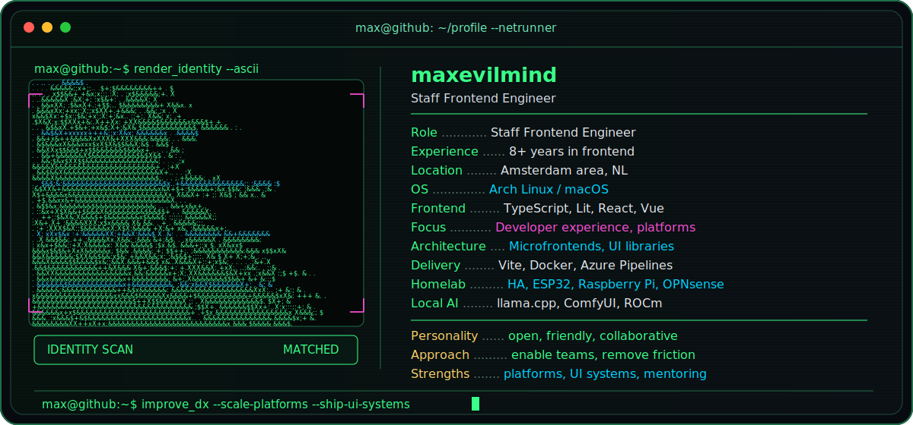

<div align="center">



# Hi, I'm Max 👋

### Staff Frontend Engineer • Developer Experience • Frontend Platforms

Building frontend systems that help teams ship consistently, safely and at scale.

</div>

---

## `whoami`

I'm a Staff Frontend Engineer based in the Netherlands with **8+ years of experience** building modern web applications, frontend platforms and developer tooling.

My main focus is **developer experience, frontend platforms, UI libraries and microfrontend architecture**. I enjoy creating the foundations that make product teams faster: reusable components, shared tooling, clear contracts, reliable delivery pipelines and migration paths that do not disrupt users or engineers.

I also care deeply about how teams work together. I like sharing knowledge, mentoring engineers, removing friction and making complex systems easier to understand and use.

---

## `stack --verbose`

| Area | Technologies |
|---|---|
| **Languages** | TypeScript • JavaScript • HTML • CSS |
| **Frontend** | Lit • React • Vue • Web Components |
| **Core focus** | Developer Experience • Frontend Platforms • UI Libraries • Microfrontends |
| **Architecture** | Design Systems • Import Maps • Platform APIs • Backwards-Compatible Migrations |
| **Tooling** | Node.js • Vite • Git • npm • pnpm • Codemods • Internal CLIs |
| **Infrastructure** | Docker • Nginx • Azure Pipelines |
| **Quality** | Sentry • Performance • CSP • Accessibility • Observability |
| **Operating systems** | Arch Linux • macOS |
| **Homelab** | Home Assistant • ESPHome • Raspberry Pi • ESP32 • OPNsense |
| **Local AI** | llama.cpp • ComfyUI • Local LLMs • AMD ROCm |

---

## `cat engineering-philosophy.txt`

```text
Build platforms that remove friction instead of adding process.
Treat developer experience as a product.
Prefer clear contracts and migration paths over hidden coupling.
Make UI libraries consistent, accessible and easy to adopt.
Keep microfrontends independently deployable without creating chaos.
Measure platform success by how easily teams can deliver.
Share knowledge and help engineers grow.
```

---

## `ps aux | grep current-focus`

- Developer experience and internal frontend tooling
- Frontend platforms and shared runtime architecture
- UI libraries and design systems
- Microfrontends and import-map-based delivery
- Backwards-compatible migrations
- Performance, observability and release engineering
- Local AI, Home Assistant and Linux projects

---

## `ls ~/projects`

| Project | Description |
|---|---|
| [`hass-entso-e`](https://github.com/maxevilmind/hass-entso-e) | Home Assistant integration work around ENTSO-E energy data |
| [`react-stepper`](https://github.com/maxevilmind/react-stepper) | Reusable React stepper component |
| [`es6-string-css-highlight`](https://github.com/maxevilmind/es6-string-css-highlight) | CSS highlighting inside JavaScript template literals |
| [`startraffic`](https://github.com/maxevilmind/startraffic) | Browser-game experiment |
| [`onedrive-file-picker`](https://github.com/maxevilmind/onedrive-file-picker) | OneDrive file-picker integration |

---

<div align="center">

### Open • Friendly • Curious • Collaborative

*Great platforms should make the right thing the easy thing.*

</div>
